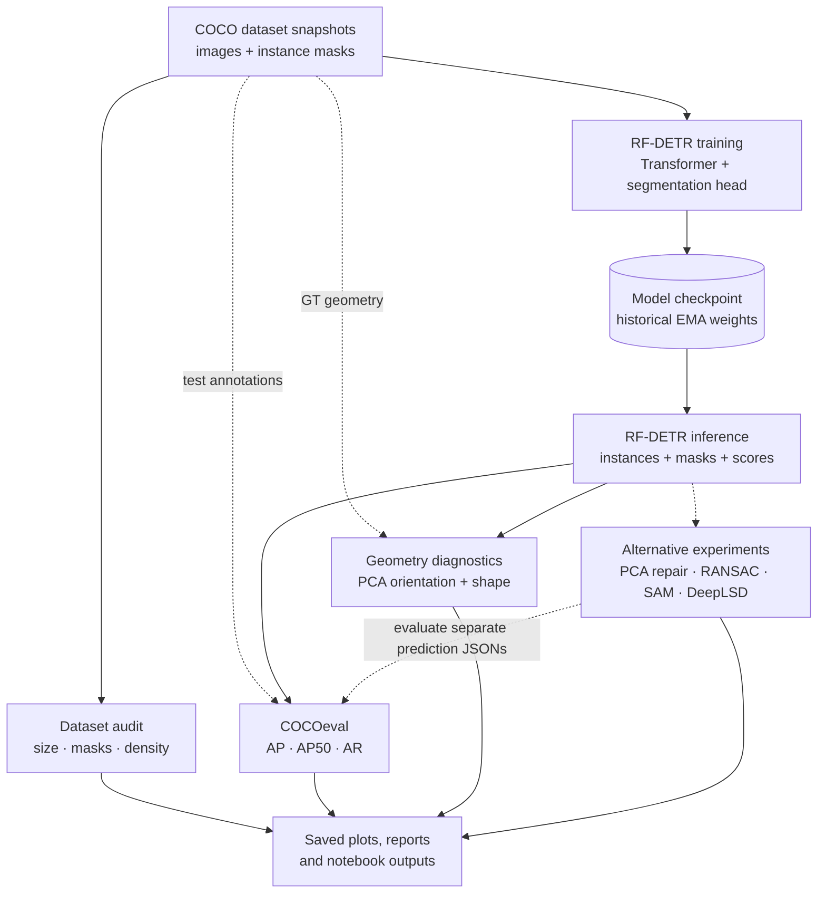
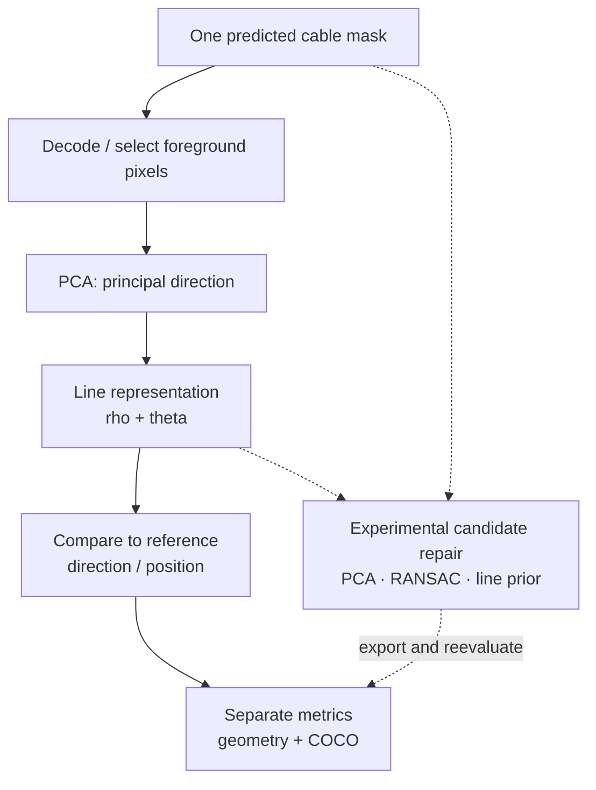

# Cable Instance Segmentation — System Design

> **Instance segmentation of thin electrical cables in aerial imagery, followed by geometry-aware analysis.**
>
> [Repository overview](../README.md) · [Complete research notebook](../Segmentation.ipynb) · [Italian project walkthrough](PROJECT_WALKTHROUGH_IT.md)

## 1. Motivation: why this problem?

Overhead electrical cables are not ordinary segmentation objects. They are **thin, long and frequently close together**. Their masks occupy very few pixels compared with the whole image or even the enclosing bounding box. Occlusion, discontinuities and small lateral errors make identification of *individual cables* difficult.

This creates two related questions:

1. **Can a query-based instance-segmentation model identify distinct cable instances**, including cluttered scenes with many neighboring cables?
2. **Do ordinary overlap metrics fully describe useful reconstruction quality**, when the object also has a meaningful geometric direction and continuity?

The project studies RF-DETR for the first question, then explores geometric analysis and alternative mask/line refinements for the second. It is an **experimental computer-vision notebook**, not a complete deployable power-line inspection product.

### Intended goals

- Inspect COCO annotations and understand what makes the dataset difficult.
- Train/evaluate transformer-based **instance segmentation**, preserving distinct predicted objects rather than only a semantic class mask.
- Diagnose performance by scene density and mask morphology.
- Analyze **PCA-derived line geometry** (orientation and position) alongside COCO segmentation metrics.
- Explore alternatives (RANSAC, mask repair, SAM, DeepLSD, line-aware re-ranking) while retaining their separate experimental settings.

**Not a demonstrated claim:** that every proposed refinement improves metrics, that all approaches ran on the same frozen data/model snapshot, or that a robust end-to-end production inference pipeline is bundled with this repository.

## 2. What is actually in the repository?

The main artifact is [`Segmentation.ipynb`](../Segmentation.ipynb), an organized **research notebook with all 106 original code cells and their saved outputs**. It includes multiple distinct model recipes, dataset variants, evaluation scripts, post-processing trials, and exploratory baselines. Its original code and experimental results were retained when adding section headings.

| Artifact | Responsibility |
| --- | --- |
| [`Segmentation.ipynb`](../Segmentation.ipynb) | All data inspections, RF-DETR training/inference, COCO evaluation, PCA, RANSAC, SAM, DeepLSD and failure-analysis experiments |
| [`checkpoint_best_ema.pth`](../checkpoint_best_ema.pth) | Git LFS-tracked historical checkpoint pointer; actual binary content requires a successful LFS download |
| [`requirements.txt`](../requirements.txt) | Baseline notebook dependencies, not a frozen environment for every optional experiment |
| [`scripts/organize_full_notebook.py`](../scripts/organize_full_notebook.py) | Documentation-only notebook organizer that preserves original code and outputs |

### Dataset representation

COCO annotations describe images, categories, and individual masks (polygons or RLE). The README describes one dataset split as **842 training and 400 test images**. The dataset files themselves are **not distributed here**. The notebook references distinct historical roots such as `dataset_finale6`, `dataset_finale8` and `dataset_finale_aug`; they must not be silently treated as interchangeable versions.

## 3. System context and experimental pipeline

The upper path illustrates the primary training/evaluation workflow. The lower paths are **optional, separately tested hypotheses**, not compulsory stages of a single production pipeline.

### Component boundaries

| Area | What it does | Original notebook code cells (zero-based) |
| --- | --- | --- |
| Environment / dataset input | Installs RF-DETR, unpacks/backs up datasets, sets Google Colab/Drive paths | 0–4, 8, 11, 13, 21–22 |
| COCO dataset audit | Checks category structure, sizes, bbox/mask relationships, continuity, thickness proxies and split morphology | 5–7, 10, 23–28, 60–65, 69–76 |
| Transformer segmentation | RF-DETR train configurations, checkpoint loading and mask predictions | 12, 19, 30, 35, 40, 66–67 |
| Segmentation evaluation | COCOeval AP/AR, GT matching, FP/FN diagnostics and crowding-based breakdowns | 18–20, 36–41, 46–47, 77–78, 100–105 |
| Geometry-aware analysis | PCA line fitting, polar representation, orientation checks, conservative repair and score re-ranking | 9, 14–15, 35, 43, 79–87, 96–98 |
| Optional external explorations | SAM refinement, RANSAC, DeepLSD/edge priors, alternate detectors and Colab environment experiments | 43–59, 88–95 |

These ranges are a **navigation aid**, not a formal dependency graph. There is intentional overlap between research questions and code blocks.

## 4. Why RF-DETR instead of only boxes or semantic segmentation?

**Why instance segmentation?** The task is not merely to answer *“where are cable pixels?”*, but potentially *“which pixels belong to each individual cable?”*. Two adjacent or overlapping cables can belong to the same semantic class but be different instances.

**Why a DETR-family approach?** RF-DETR uses query-based object prediction with a transformer-based visual encoder and a segmentation head. This is a sensible candidate for learning separate cable instances, but its use alone does not guarantee success when cable separation becomes ambiguous.

**Training choices worth explaining:** one historical training cell (original code cell 66) specifies a DINOv2 windowed-small encoder, 1200-pixel resolution, 200 queries, 60 epochs, differential encoder/decoder learning rates, gradient accumulation, clipping and EMA. Another cell (12) uses a different 30-epoch experiment. These are **historical configurations**, not a single canonical recipe guaranteed to reproduce the README results.

**Trade-offs:** high resolution can retain fine cable details but increases computational/memory costs; query count and inference top-K decisions can affect recall when a scene contains many instances; architecture and dataset changes should be compared only under the same protocol.

## 5. Why add geometry to pixel-level evaluation?

Thin masks may have modest IoU if shifted by only a few pixels, even if their main direction is similar. Conversely, a geometrically plausible line can still miss distinct instances.

PCA is used to summarize mask pixels through a **dominant direction**. From a mask, the code estimates line-related parameters such as **rho and theta** and explores line reconstruction or soft geometric re-ranking.

**What each measurement answers**

- **COCO AP/AR**: how well predicted *instance masks and detections* match ground truth under the evaluation protocol.
- **PCA orientation/line measures**: how well an estimated line represents a cable's dominant geometric direction.
- **Density-stratified metrics**: where the model's ability to separate and recover individual cables deteriorates as instance count grows.

Geometry metrics **complement** overlap and instance-count metrics; they do not replace them. This is the main research motivation behind testing PCA, RANSAC, SAM, line priors and re-ranking.

## 6. Experiments kept distinct — not a fabricated unified model

| Hypothesis | Method examined | Why it might help | Caution |
| --- | --- | --- | --- |
| Long cables are approximately linear locally | PCA reconstruction of mask pixels | Recover dominant direction and bridge small gaps | A single line can oversimplify curved or multiple merged cables |
| Spurious pixels disrupt line fitting | RANSAC regression and inlier checks | Potential robustness to outliers | Depends on inlier threshold, support size and line model |
| Initial masks can guide a general segmenter | SAM-based refinement | Explore whether prompts improve thin-mask quality | Some experiments use GT or evaluation-driven acceptance; not a deployable no-oracle improvement claim |
| Image gradients carry thin-line evidence | DeepLSD and edge/line priors | Incorporate geometric evidence alongside predicted masks | Requires additional model/software; not necessarily independent results |
| Duplicate or crowded predictions waste top-K slots | Score re-ranking, NMS, diversity penalties | Potentially recover more distinct cable instances | Must tune on validation and freeze parameters before testing |

The notebook also contains experiments with tiling, shift/TTA, densification/oversampling and external model repositories. These are preserved as research branches, not described as a single validated deployed system.

## 7. What the saved metrics actually mean

**Historical results quoted by the README** (one archived COCO evaluation in original code cell 78):

| Metric | Archived value | Interpretation |
| --- | ---: | --- |
| Segmentation AP@IoU 0.50 | **0.528** | Standard COCO AP50 in that evaluated setting |
| Segmentation AR@10 | **0.280** | COCO average recall over IoU thresholds, with maximum 10 detections per image |
| `angle_diff` | **0.9989555** | Mean **angular similarity score**, not an angular error in degrees |

**Critical correction to the previous README:** in cell 78 the angular score is computed as `exp(-0.12 × angular_difference_in_radians)`. Consequently **0.9989555 is dimensionless and close to 1**, not **0.9989555°**. The notebook does not provide a directly equivalent mean angular error in degrees from that output. It would be inaccurate to present the similarity score as an angular MAE.

**Another metric-labeling caveat:** for default COCO `maxDets=[1,10,100]`, `stats[6]` is AR@1, `stats[7]` is AR@10, and `stats[8]` is AR@100. Some exploratory cells mislabel these indices (including density analyses naming `stats[8]` as `mAR@10`). Their labels should be corrected or their calculations rerun **before** comparing those particular recall figures.

### What can be said about dense scenes?

In the archived density analysis (original code cell 100), segmentation AP50 is much lower for images containing at least ten annotated cables than for sparser images. This is **useful failure-analysis evidence for that saved prediction snapshot**, but does not prove the performance of every checkpoint or post-processing variant. Avoid reusing the cell's mislabeled recall numbers.

### Reproducibility limitations

- Different dataset snapshots and checkpoint choices appear within one notebook.
- Some threshold sweeps are conducted on a test set; these are exploratory and must not be used as unbiased held-out results.
- Some parameter studies use ground truth in candidate selection (oracle-style diagnostics).
- Results are preserved as historical notebook outputs; this documentation does not claim a new GPU run or independent reproduction.
- The repository lacks a bundled dataset and a fully frozen Colab/CUDA environment; Git LFS must resolve the actual checkpoint bytes.

## 8. Decisions and trade-offs to discuss in a technical interview

| Design choice | Reason to try it | Trade-off |
| --- | --- | --- |
| **RF-DETR instance masks** | Capture individual cable objects, not just category pixels | Very thin and overlapping instances remain hard to separate |
| **High-resolution imagery** | Preserve fine spatial information | More GPU memory and inference/training cost |
| **COCOeval** | Standardized detection/segmentation benchmarking | IoU can be unforgiving for filamentary objects |
| **PCA-based line features** | Expose geometric regularity not explicit in AP/AR | Orientation alone cannot ensure correct instance identity |
| **RANSAC / SAM / DeepLSD trials** | Test alternative priors and mask-repair hypotheses | Additional costs, data dependencies and evaluation bias risk |
| **Density-based failure analysis** | Find performance degradation hidden by global averages | Needs enough images per density bucket and consistent metrics |

## 9. Next steps for a defensible evaluation

1. Choose **one frozen dataset version** and document the exact train/validation/test image IDs.
2. Record one checkpoint identifier, model configuration and precise environment versions.
3. Select score thresholds and geometry parameters on **validation only**; keep test held out.
4. Recompute **standard COCO AP, AP50, AR@10** with correct indexing.
5. Compute actual angular error in **degrees** separately from any exponential similarity score.
6. Report instance density, mask thickness and occlusion effects, plus before/after effects of *each* optional refinement.
7. Preserve GT-assisted/oracle studies only as **upper bounds or diagnostics**, never directly comparable deployable pipelines.

These are proposed improvements to the evaluation protocol, **not results already verified**.

## 10. Code map and research integrity

See the complete notebook's Markdown sections, which preserve the original 106 code cells. The [organizer script](../scripts/organize_full_notebook.py) records the original experiment blocks and verifies that code and outputs were not removed.

**Precise takeaway:** The project's strongest motivation is not “a transformer detects cables.” It is **studying instance segmentation for difficult filamentary objects and understanding what pixel overlap, geometry and crowding each reveal about the result**.
